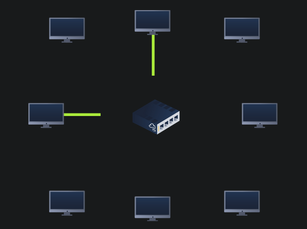

# Understanding SMB

## What is SMB ?

**SMB - Server Message Block Protocol - is a client-server communication protocol used for sharing access to files, printers, serial ports and other resources on a network.**

**Servers make file systems and other resources (printers, named pipes, APIs) available to clients on the network. Client computers may have their own hard disks, but they also want access to the shared file systems and printers on the servers.**

**The SMB protocol is known as a response-request protocol, meaning that it transmits multiple messages between the client and server to establish a connection. Clients connect to servers using TCP/IP (actually NetBIOS over TCP/IP as specified in RFC1001 and RFC1002), NetBEUI or IPX/SPX.**

## How does SMB works ?

<figure><figcaption></figcaption></figure>

**Once they have established a connection, clients can then send commands (SMBs) to the server that allow them to access shares, open files, read and write files, and generally do all the sort of things that you want to do with a file system. However, in the case of SMB, these things are done over the network.**

**What runs SMB?**

**Microsoft Windows operating systems since Windows 95 have included client and server SMB protocol support. Samba, an open source server that supports the SMB protocol, was released for Unix systems.**

:point\_right: **We can remotely access the SMB share using the syntax:**

```
smbclient //[IP]/[SHARE]
```

**Followed by the tags:**

\-U \[name] : to specify the user

\-p \[port] : to specify the port

:point\_right: **What would be the correct syntax to access an SMB share called "secret" as user "suit" on a machine with the IP 10.10.10.2 on the default port?**

```
smbclient //10.10.10.2/secret -U suit -p 445
```

:point\_right: **What's the standard SMB port ?**

```
139 and 445
```
